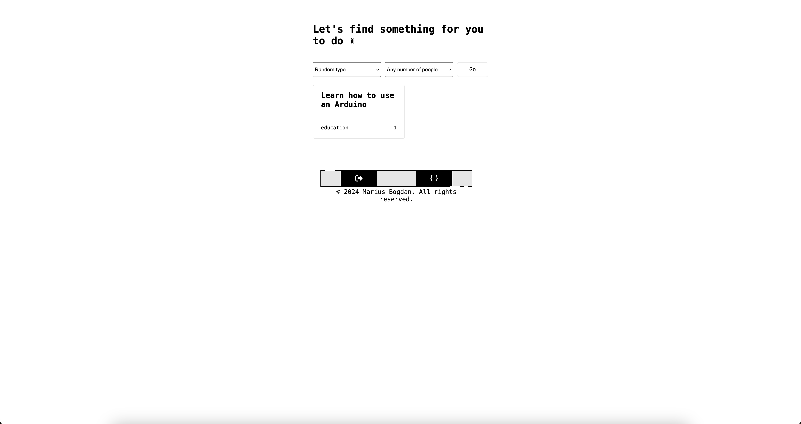

# Something To Do


[](#)
> A dynamic web application that generates a random activity for users based on an external API. Users can filter by activity type or the number of participants to find personalized recommendations for what to do.


## Overview

**Something To Do** is a simple yet engaging web application that helps users find random activities to do when they are unsure of what to engage in. The app fetches activities from an external API and allows users to filter their search by category and the number of participants. This makes it a great tool for discovering new and fun ways to spend time, whether alone or with others.

## Preview

<p align="center">
  
</p>

## Features

- **Random Activity Suggestions:** Fetches a new activity each time a request is made.
- **Filtering Options:** Users can filter activities by category and number of participants.
- **Real-Time Fetching:** Uses API requests to provide dynamic suggestions.


## Live Demo

**Explore the live version here:** [View Live Demo](https://marius-bogdan.com/projects/something-to-do/)

## Local Setup

1. **Clone** the repository:
   ```bash
   git clone https://github.com/MIBogdan/something-to-do.git
   ```
2. **Navigate** to the project folder:
   ```bash
   cd something-to-do
   ```
3. **Install** dependencies:
   ```bash
   npm install
   ```

4. **Run** the application:
   ```bash
   npm start
   ```
- The development server will open automatically in your default browser.
- **If it doesn't open automatically**,manually visit: http://localhost:3000 in your browser.

4. **Terminate** the server:
- **On macOS/Linux:** Press `Control + C` in the terminal. 
- **On Windows:** Press `Ctrl + C` in the Command Prompt or PowerShell. 
---

## Author

**Marius Bogdan**  
[Personal portfolio](https://marius-bogdan.com/)

Feel free to reach out for any questions or collaborations!

## License

This project is provided for testing and demonstration purposes only. All rights are reserved. No part of this project may be redistributed, reuploaded, or used in any manner (commercially or otherwise) without explicit written permission from the author.
